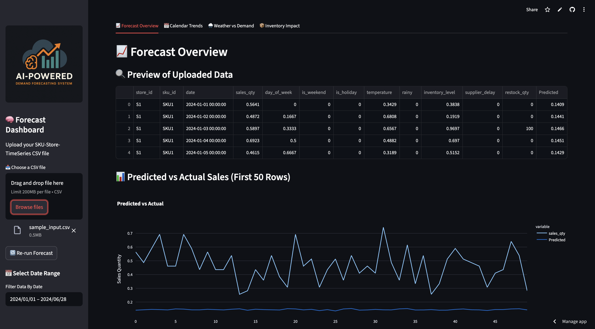
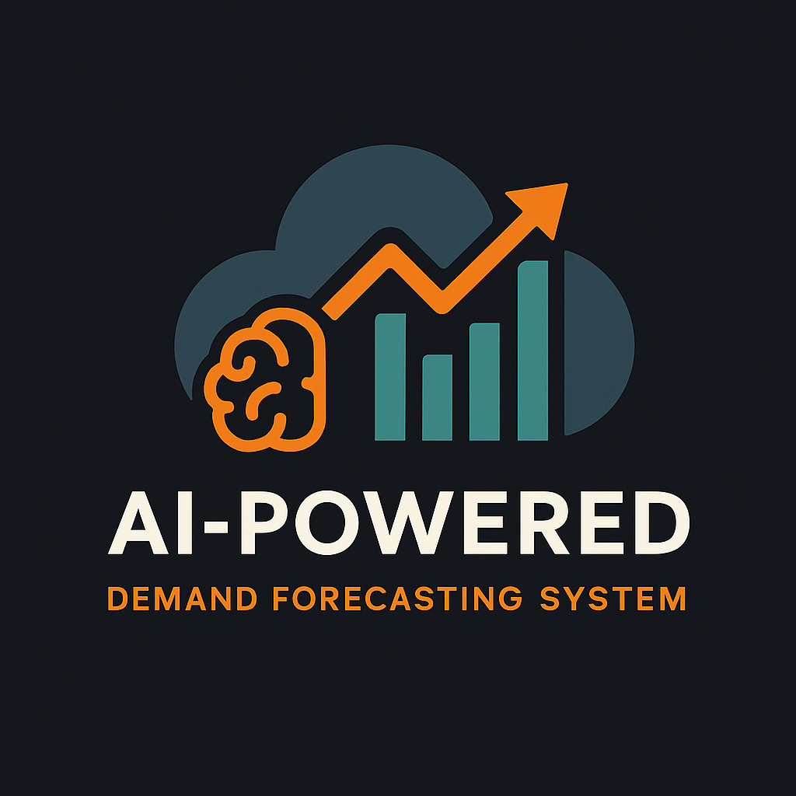

# AI-powered-Supply-Chain-Demand-Forecasting-System


 

🌐 **Live App**: [ai-logistics-lens.streamlit.app](https://ai-logistics-lens.streamlit.app/)

---

## 📌 Overview

The **AI-powered Supply Chain Demand Forecasting System** is an intelligent forecasting platform built to help businesses optimize their inventory, logistics, and procurement using deep learning.

By analyzing SKU-store-level time series data, the system predicts future demand using a trained LSTM model. This enables proactive decisions that reduce stockouts, avoid overstocking, and improve supply chain efficiency.

### ✅ Key Benefits

- Reduce stockouts and overstocking  
- Improve replenishment strategies  
- Align logistics and supplier planning  
- Make data-driven inventory decisions  

---

## 🚀 Features

| Feature                         | Description                                                                |
|---------------------------------|----------------------------------------------------------------------------|
| 📤 CSV Upload                   | Upload SKU-Store-Time series CSV for forecasting                           |
| 📅 Date Range Filtering         | Filter and analyze predictions within a specific date window               |
| 📈 LSTM-Based Forecasting       | Uses a trained LSTM model to predict future demand                         |
| 📊 Predicted vs Actual Chart    | Line graph comparing forecasted and actual sales values                    |
| 📥 CSV Export                   | Download forecast results as a CSV for further use                         |
| 📊 Feature Importance View      | Estimates which features most influenced the LSTM predictions              |
| 🔁 Re-run Forecast Button       | Easily re-run the forecast without reloading the page                      |
| 🌦️ Weather Impact Analysis      | Shows how rain and temperature influence demand                            |
| 📆 Calendar Trend Detection     | Understand weekly/daily seasonal patterns                                  |
| 📦 Inventory & Supplier Effects | Assess how inventory levels and delays affect sales trends                 |

---

## 🧠 Model Info

- **Architecture**: LSTM (Long Short-Term Memory)
- **Input Features**: `sales_qty`, `temperature`, `rainy`, `inventory_level`, `supplier_delay`, and more
- **Output**: Predicted future sales quantities
- **Frameworks Used**: `PyTorch`, `pandas`, `scikit-learn`, `Streamlit`, `Plotly`

---

## ✅ Use Cases

This tool is useful across industries like retail, manufacturing, logistics, and supply chain management. It enables:

- ✅ **Reduce stockouts and overstocking**
- ✅ **Improve replenishment strategies**
- ✅ **Align logistics and supplier planning**
- ✅ **Make data-driven inventory decisions**
- ✅ **Optimize restocking for retail chains**
- ✅ **Forecast high-demand periods for e-commerce**
- ✅ **Improve production planning for manufacturers**
- ✅ **Support warehouse & delivery efficiency**

---

## 🖼️ Logo

 

---

## 📦 Installation (Local Setup)

```bash
git clone https://github.com/yourusername/AI-powered-Supply-Chain-Demand-Forecasting-System.git
cd AI-powered-Supply-Chain-Demand-Forecasting-System
pip install -r requirements.txt
streamlit run app.py
